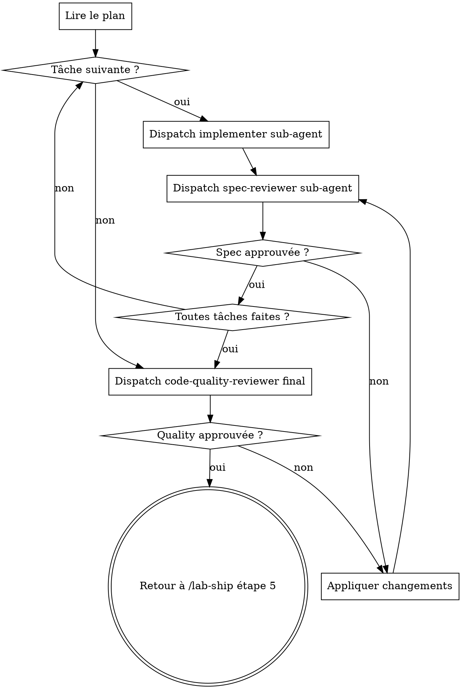

# /lab-implémenter — exécution par sub-agents

Phase 3 du pipe `/lab-ship`. **Aucune interaction humaine.** Lit le plan produit
par `/lab-planifier`, dispatche un sub-agent par tâche, exécute la double revue
(spec puis code quality), boucle jusqu'à approbation, rend la main à `/lab-ship`
étape 5 (push + PR).

## Contrat

- Pas de questions à l'humain. Ambiguïté inter-agent (sub-agent → controller) :
  résolue par le controller via le choix le plus simple, notée dans le rapport
  de fin retourné à `/lab-ship`.
- Pas de menu de fin. Sur approbation finale du code-quality-reviewer, **rendre
  la main à `/lab-ship`** étape 5 (push + PR). **Ne pas** invoquer une skill de
  type `finishing-a-development-branch`.
- Stop sur blocage durable uniquement.

## Flow

## Déroulé

1. **Lire le plan** (dernier fichier dans `docs/superpowers/plans/` ou path fourni).
2. **Pour chaque tâche du plan** :
   - **Dispatch implementer sub-agent**. Tool `Agent`, `subagent_type:
     general-purpose`. Prompt = contenu de `implementer-prompt.md` + référence à
     la tâche courante. Le sub-agent implémente les steps de la tâche jusqu'au
     commit.
   - **Dispatch spec-reviewer sub-agent**. Tool `Agent`, `subagent_type:
     general-purpose`. Prompt = contenu de `spec-reviewer-prompt.md` + le diff
     de la tâche + référence à la spec.
   - **Si refus** : appliquer les changements demandés (controller, sans nouveau
     dispatch implementer sauf si nécessaire), relancer le spec-reviewer.
     Boucler jusqu'à approbation. Limite raisonnable : 3 cycles, puis trancher.
   - **Si approbation** : passer à la tâche suivante.
3. **Code-quality-reviewer final** (sur l'ensemble de l'implémentation). Tool
   `Agent`, prompt = contenu de `code-quality-reviewer-prompt.md` + diff complet
   depuis le point de départ.
   - **Si refus** : appliquer les changements, relancer. Même limite de 3 cycles.
   - **Si approbation** : étape 4.
4. **Rendre la main à `/lab-ship`** avec un rapport bref : tâches faites,
   décisions tranchées sans demander, ambiguïtés résolues. `/lab-ship` enchaîne
   sur l'étape 5 (push + PR).

## Boucle de revue — règles

- Le controller (cette skill) applique les changements demandés par les reviewers
  sans redispatcher l'implementer si le changement est trivial (renommage,
  reformulation, fix mineur). Pour un changement non trivial, redispatcher.
- Si un sub-agent pose une question, le controller tranche sans remonter à
  l'humain.
- Maximum 3 cycles par revue. Au 3ᵉ refus, controller tranche et continue.

## Principes

- Un sub-agent = une tâche. Pas de partage d'état entre sub-agents.
- Les prompts compagnons (anglais) sont la source de vérité du comportement des
  sub-agents — ne pas les paraphraser dans cette skill.
- Tout commit est fait par le sub-agent dans sa tâche.
- Rendre la main à `/lab-ship` étape 5, jamais à autre chose.
