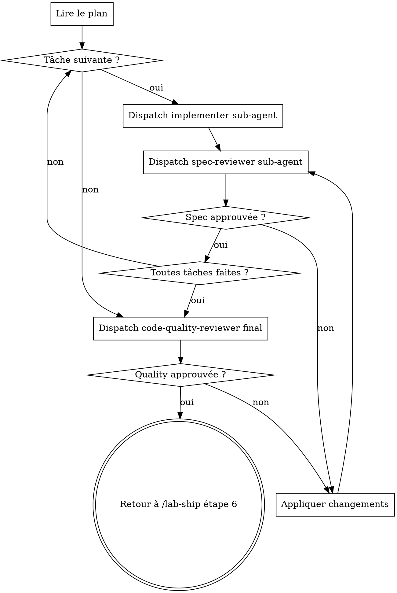

# Nativiser le pipe `/lab-ship` — Plan d'implémentation

> **For agentic workers:** REQUIRED SUB-SKILL: Use superpowers:subagent-driven-development to implement this plan task-by-task. Steps use checkbox (`- [ ]`) syntax for tracking.

**Goal:** Remplacer les skills `superpowers:*` vendorées par des skills natives en français (`lab-cadrer`, `lab-planifier`, `lab-implémenter`), supprimer `/lab-work` (doublon inliné), et simplifier la validation humaine à un gate unique en fin de cadrage.

**Architecture:** Trois nouvelles skills dans `.claude/skills/lab-*` qui se chaînent via le tool `Skill`. Les SKILL.md sont en français, élagués (cibles ~60/~70/~130 lignes). Les prompts compagnons (reviewers, implementer) restent en anglais, copiés inchangés depuis le fork vendoré. Le contrat de validation est : `lab-cadrer` demande **une** validation explicite du design en fin de phase ; les deux suivantes ne parlent pas à l'humain.

**Tech Stack:** Markdown + frontmatter YAML. Outils : `Write`, `Edit`, `Read`, `Bash`, `git`.

Spec de référence : `docs/superpowers/specs/2026-05-28-nativiser-pipe-lab-ship-design.md`.

---

## Cartographie des fichiers

| Fichier | Rôle | Action |
|---|---|---|
| `.claude/skills/lab-cadrer/SKILL.md` | Cadrage + spec + validation unique | Créer |
| `.claude/skills/lab-planifier/SKILL.md` | Plan d'impl autonome | Créer |
| `.claude/skills/lab-planifier/plan-document-reviewer-prompt.md` | Prompt sub-agent reviewer (anglais) | Copier depuis fork |
| `.claude/skills/lab-implémenter/SKILL.md` | Orchestration sub-agents double-revue | Créer |
| `.claude/skills/lab-implémenter/implementer-prompt.md` | Prompt sub-agent (anglais) | Copier depuis fork |
| `.claude/skills/lab-implémenter/spec-reviewer-prompt.md` | Prompt sub-agent (anglais) | Copier depuis fork |
| `.claude/skills/lab-implémenter/code-quality-reviewer-prompt.md` | Prompt sub-agent (anglais) | Copier depuis fork |
| `.claude/skills/lab-ship/SKILL.md` | Pipe orchestrateur | Modifier (inliner lab-work, remplacer 3 invocations, retirer section fork) |
| `CLAUDE.md` (racine) | Doctrine atelier | Modifier (retirer mention `/lab-work`) |
| `.claude/skills/lab-work/` | Doublon | Supprimer le dossier |
| `.claude/skills/superpowers/` | Vendoring obsolète | Supprimer le dossier |

---

## Task 1 : Créer la skill `lab-cadrer`

**Files:**
- Create: `.claude/skills/lab-cadrer/SKILL.md`

Sources d'inspiration (lire avant d'écrire) :
- `.claude/skills/superpowers/brainstorming/SKILL.md` (130 l, upstream patché)

Cible : ~60 lignes. Élagage : retirer le Visual Companion, les anti-patterns méta, le bandeau "fork patché", les redites "What this skill does".

- [ ] **Step 1 : Vérifier que la branche courante n'est pas `main`**

```bash
test "$(git branch --show-current)" != "main" || { echo "Sur main — arrêt"; exit 1; }
```

- [ ] **Step 2 : Créer le fichier `lab-cadrer/SKILL.md`**

Écrire ce contenu exact :

```markdown
---
name: lab-cadrer
description: Phase de cadrage du pipe /lab-ship — explore le contexte projet, pose les clarifying questions à l'humain, présente le design et demande une validation explicite, puis écrit la spec et chaîne sur lab-planifier. Seule skill du pipe qui parle à l'humain.
---

# /lab-cadrer — cadrage + spec

Phase 1 du pipe `/lab-ship`. **Seul gate humain de tout le pipe** : la validation
explicite du design en fin de cadrage.

> Phase 2 (plan) : `/lab-planifier`. Phase 3 (impl) : `/lab-implémenter`.

## Contrat

- **Une seule interaction humaine côté contenu** : les clarifying questions, puis
  la présentation du design avec demande de validation explicite (« OK avec ce
  design ? »).
- **Sur "go"** : écrire la spec, commit, **enchaîner directement** sur
  `/lab-planifier` via le tool `Skill`. Pas de relecture de spec, pas de
  question additionnelle.
- **Sur refus / changements demandés** : ajuster le design, re-présenter, re-demander.
- Aucune autre skill du pipe (`/lab-planifier`, `/lab-implémenter`) ne parlera à
  l'humain. Toute ambiguïté résiduelle après cadrage est tranchée par le choix le
  plus simple, à noter dans le message de fin de `/lab-ship`.

## Déroulé

1. **Explorer le contexte (silencieux).** Lire les fichiers pertinents, le
   `CLAUDE.md` du projet, les commits récents, la structure. Aucun message à
   l'humain à cette étape sauf pour signaler un blocage.
2. **Clarifying questions, une à la fois.** Utiliser `AskUserQuestion` (multiple
   choice préféré, ouvert si nécessaire). Comprendre : but, contraintes, succès,
   trade-offs.
3. **Présenter le design en un bloc.** Sections : architecture, composants, flux
   de données, gestion d'erreur, tests. Échelle à la taille du sujet (quelques
   phrases pour un petit changement, jusqu'à 200-300 mots par section pour un gros).
   Avant le design, lister 2-3 approches alternatives avec trade-offs et la
   recommandation.
4. **Demander la validation explicite.** « OK avec ce design ? Si oui, j'écris la
   spec et j'enchaîne. »
5. **Sur validation** : écrire la spec dans
   `docs/superpowers/specs/AAAA-MM-JJ-<sujet>-design.md`, échelle adaptée. Commit.
6. **Self-review inline de la spec** : scan placeholders, cohérence interne,
   scope, ambiguïté. Corriger inline. Pas de re-validation humaine.
7. **Chaîner sur `/lab-planifier`** via le tool `Skill`. Annoncer brièvement :
   « Spec écrite. J'enchaîne sur le plan. »

## Principes

- YAGNI ruthlessly : retirer les features non demandées.
- Décomposer en unités à responsabilité claire si la tâche est non triviale.
- Suivre les patterns existants du codebase ; ne pas refactorer ce qui ne sert
  pas l'objectif.
- Spec scalable : quelques phrases pour un changement trivial, plus pour un gros
  morceau.
```

- [ ] **Step 3 : Vérifier le contenu**

```bash
head -4 .claude/skills/lab-cadrer/SKILL.md
grep -c "validation explicite" .claude/skills/lab-cadrer/SKILL.md
grep -c "Skill\`" .claude/skills/lab-cadrer/SKILL.md
grep -c "lab-planifier" .claude/skills/lab-cadrer/SKILL.md
wc -l .claude/skills/lab-cadrer/SKILL.md
```

Expected :
- Le frontmatter affiche `name: lab-cadrer` + sa description
- `validation explicite` : ≥ 2 (contrat + déroulé)
- `Skill` (entre backticks) : ≥ 2
- `lab-planifier` : ≥ 2
- `wc -l` : entre 50 et 80

- [ ] **Step 4 : Commit**

```bash
git add .claude/skills/lab-cadrer/SKILL.md
git commit -m "🧠 skill /lab-cadrer : cadrage + spec, gate unique de validation"
```

---

## Task 2 : Créer la skill `lab-planifier`

**Files:**
- Create: `.claude/skills/lab-planifier/SKILL.md`
- Create: `.claude/skills/lab-planifier/plan-document-reviewer-prompt.md` (copie depuis fork)

Sources d'inspiration :
- `.claude/skills/superpowers/writing-plans/SKILL.md` (149 l, upstream patché)
- `.claude/skills/superpowers/writing-plans/plan-document-reviewer-prompt.md` (49 l, à copier inchangé)

Cible SKILL.md : ~70 lignes.

- [ ] **Step 1 : Copier le prompt reviewer (anglais, inchangé)**

```bash
cp .claude/skills/superpowers/writing-plans/plan-document-reviewer-prompt.md \
   .claude/skills/lab-planifier/plan-document-reviewer-prompt.md
```

- [ ] **Step 2 : Vérifier la copie**

```bash
diff .claude/skills/superpowers/writing-plans/plan-document-reviewer-prompt.md \
     .claude/skills/lab-planifier/plan-document-reviewer-prompt.md
```

Expected : aucune sortie (fichiers identiques).

- [ ] **Step 3 : Créer `lab-planifier/SKILL.md`**

Écrire ce contenu exact :

```markdown
---
name: lab-planifier
description: Phase de planification du pipe /lab-ship — lit la spec produite par lab-cadrer, écrit un plan d'implémentation détaillé (tâches bite-sized, TDD, commits fréquents), commit, et chaîne sur lab-implémenter. Aucune interaction humaine.
---

# /lab-planifier — plan d'implémentation

Phase 2 du pipe `/lab-ship`. **Aucune interaction humaine.** Lit la spec écrite
par `/lab-cadrer`, produit le plan, commit, chaîne sur `/lab-implémenter`.

## Contrat

- Pas de questions à l'humain. Toute ambiguïté résiduelle → tranche par le choix
  le plus simple, note-la dans un commentaire en tête du plan.
- Pas de menu d'exécution à la fin : l'exécution est toujours `subagent-driven`
  via `/lab-implémenter`.
- Stop sur blocage durable uniquement (impossible d'avancer). Sinon, continuer.

## Déroulé

1. **Lire la spec.** Dernier fichier dans `docs/superpowers/specs/` (ou path
   fourni par `/lab-cadrer`).
2. **Cartographier les fichiers** : créer/modifier/supprimer, avec leur
   responsabilité. Boundaries claires, petits fichiers focalisés. Suivre les
   patterns existants.
3. **Décomposer en tâches bite-sized** (2-5 min chacune). Une tâche = un
   composant cohérent. Chaque tâche enchaîne des steps : écrire le test → vérifier
   qu'il échoue → implémenter → vérifier qu'il passe → commit.
4. **Écrire chaque step en plein** : code complet, commandes exactes, sortie
   attendue. **Aucun placeholder** ("TODO", "implement later", "similar to Task N").
   Si une tâche change du code, le code apparaît dans le step.
5. **Écrire le plan** dans `docs/superpowers/plans/AAAA-MM-JJ-<sujet>.md` avec
   l'en-tête standard :

   ```
   # <Feature> — Plan d'implémentation

   > **For agentic workers:** REQUIRED SUB-SKILL: Use superpowers:subagent-driven-development to implement this plan task-by-task. Steps use checkbox (`- [ ]`) syntax for tracking.

   **Goal:** ...
   **Architecture:** ...
   **Tech Stack:** ...

   Spec de référence : `docs/superpowers/specs/<spec>.md`.
   ```

6. **Self-review du plan** (inline) : couverture de la spec, scan placeholders,
   cohérence des types/signatures entre tâches. Fixer inline.
7. **Dispatcher le reviewer** (sub-agent, prompt anglais inchangé) :
   `Agent` avec `subagent_type: general-purpose`, prompt =
   contenu de `plan-document-reviewer-prompt.md` + le plan en input. Appliquer
   les changements demandés.
8. **Commit** le plan.
9. **Chaîner sur `/lab-implémenter`** via le tool `Skill`.

## Principes

- DRY, YAGNI, TDD, commits fréquents.
- Chaque step est une action courte (2-5 min).
- Les chemins de fichiers sont exacts.
- Le code des steps est complet, pas allusif.
```

- [ ] **Step 4 : Vérifier le contenu**

```bash
head -4 .claude/skills/lab-planifier/SKILL.md
grep -c "Aucune interaction humaine" .claude/skills/lab-planifier/SKILL.md
grep -c "lab-implémenter" .claude/skills/lab-planifier/SKILL.md
grep -c "Skill\`" .claude/skills/lab-planifier/SKILL.md
wc -l .claude/skills/lab-planifier/SKILL.md
```

Expected :
- frontmatter `name: lab-planifier`
- `Aucune interaction humaine` : ≥ 1
- `lab-implémenter` : ≥ 2
- `Skill` (backticks) : ≥ 1
- `wc -l` : entre 60 et 90

- [ ] **Step 5 : Commit**

```bash
git add .claude/skills/lab-planifier/
git commit -m "📋 skill /lab-planifier : plan d'impl autonome, aucun gate humain"
```

---

## Task 3 : Créer la skill `lab-implémenter`

**Files:**
- Create: `.claude/skills/lab-implémenter/SKILL.md`
- Create: `.claude/skills/lab-implémenter/implementer-prompt.md` (copie depuis fork)
- Create: `.claude/skills/lab-implémenter/spec-reviewer-prompt.md` (copie depuis fork)
- Create: `.claude/skills/lab-implémenter/code-quality-reviewer-prompt.md` (copie depuis fork)

Sources d'inspiration :
- `.claude/skills/superpowers/subagent-driven-development/SKILL.md` (281 l, upstream patché)
- Les trois prompts compagnons (anglais, à copier inchangés).

Cible SKILL.md : ~130 lignes.

- [ ] **Step 1 : Copier les trois prompts (anglais, inchangés)**

```bash
cp .claude/skills/superpowers/subagent-driven-development/implementer-prompt.md \
   .claude/skills/lab-implémenter/implementer-prompt.md
cp .claude/skills/superpowers/subagent-driven-development/spec-reviewer-prompt.md \
   .claude/skills/lab-implémenter/spec-reviewer-prompt.md
cp .claude/skills/superpowers/subagent-driven-development/code-quality-reviewer-prompt.md \
   .claude/skills/lab-implémenter/code-quality-reviewer-prompt.md
```

- [ ] **Step 2 : Vérifier les copies**

```bash
for f in implementer-prompt.md spec-reviewer-prompt.md code-quality-reviewer-prompt.md; do
  diff ".claude/skills/superpowers/subagent-driven-development/$f" \
       ".claude/skills/lab-implémenter/$f" || echo "DIFF: $f"
done
```

Expected : aucune sortie (les trois fichiers sont identiques aux sources).

- [ ] **Step 3 : Créer `lab-implémenter/SKILL.md`**

Écrire le contenu suivant. Sections obligatoires : frontmatter, contrat, déroulé
(diagramme dot inclus), boucle de revue, principes.

```markdown
---
name: lab-implémenter
description: Phase d'implémentation du pipe /lab-ship — exécute le plan tâche par tâche via des sub-agents (implementer puis spec-reviewer ; code-quality-reviewer final), boucle interne jusqu'à approbation, rend la main à /lab-ship pour push + PR. Aucune interaction humaine.
---

# /lab-implémenter — exécution par sub-agents

Phase 3 du pipe `/lab-ship`. **Aucune interaction humaine.** Lit le plan produit
par `/lab-planifier`, dispatche un sub-agent par tâche, exécute la double revue
(spec puis code quality), boucle jusqu'à approbation, rend la main à `/lab-ship`
étape 6 (push + PR).

## Contrat

- Pas de questions à l'humain. Ambiguïté inter-agent (sub-agent → controller) :
  résolue par le controller via le choix le plus simple, notée dans le rapport
  de fin retourné à `/lab-ship`.
- Pas de menu de fin. Sur approbation finale du code-quality-reviewer, **rendre
  la main à `/lab-ship`** étape 6 (push + PR). **Ne pas** invoquer une skill de
  type `finishing-a-development-branch`.
- Stop sur blocage durable uniquement.

## Flow



## Déroulé

1. **Lire le plan** (dernier fichier dans `docs/superpowers/plans/` ou path fourni).
2. **Pour chaque tâche du plan** :
   - **Dispatch implementer sub-agent**. Tool `Agent`, `subagent_type:
     general-purpose`. Prompt = contenu de `implementer-prompt.md` + référence à
     la tâche courante. Le sub-agent implémente les steps de la tâche jusqu'au
     commit.
   - **Dispatch spec-reviewer sub-agent**. Tool `Agent`, `subagent_type:
     general-purpose`. Prompt = contenu de `spec-reviewer-prompt.md` + le diff
     de la tâche + référence à la spec.
   - **Si refus** : appliquer les changements demandés (controller, sans nouveau
     dispatch implementer sauf si nécessaire), relancer le spec-reviewer.
     Boucler jusqu'à approbation. Limite raisonnable : 3 cycles, puis trancher.
   - **Si approbation** : passer à la tâche suivante.
3. **Code-quality-reviewer final** (sur l'ensemble de l'implémentation). Tool
   `Agent`, prompt = contenu de `code-quality-reviewer-prompt.md` + diff complet
   depuis le point de départ.
   - **Si refus** : appliquer les changements, relancer. Même limite de 3 cycles.
   - **Si approbation** : étape 4.
4. **Rendre la main à `/lab-ship`** avec un rapport bref : tâches faites,
   décisions tranchées sans demander, ambiguïtés résolues. `/lab-ship` enchaîne
   sur l'étape 6 (push + PR).

## Boucle de revue — règles

- Le controller (cette skill) applique les changements demandés par les reviewers
  sans redispatcher l'implementer si le changement est trivial (renommage,
  reformulation, fix mineur). Pour un changement non trivial, redispatcher.
- Si un sub-agent pose une question, le controller tranche sans remonter à
  l'humain.
- Maximum 3 cycles par revue. Au 3ᵉ refus, controller tranche et continue.

## Principes

- Un sub-agent = une tâche. Pas de partage d'état entre sub-agents.
- Les prompts compagnons (anglais) sont la source de vérité du comportement des
  sub-agents — ne pas les paraphraser dans cette skill.
- Tout commit est fait par le sub-agent dans sa tâche.
- Rendre la main à `/lab-ship` étape 6, jamais à autre chose.
```

- [ ] **Step 4 : Vérifier le contenu**

```bash
head -4 .claude/skills/lab-implémenter/SKILL.md
grep -c "Aucune interaction humaine" .claude/skills/lab-implémenter/SKILL.md
grep -c "Rendre la main à \`/lab-ship\`" .claude/skills/lab-implémenter/SKILL.md
grep -c "code-quality-reviewer" .claude/skills/lab-implémenter/SKILL.md
grep -c "spec-reviewer" .claude/skills/lab-implémenter/SKILL.md
grep -c "implementer-prompt" .claude/skills/lab-implémenter/SKILL.md
wc -l .claude/skills/lab-implémenter/SKILL.md
ls .claude/skills/lab-implémenter/
```

Expected :
- frontmatter `name: lab-implémenter`
- `Aucune interaction humaine` : ≥ 1
- `Rendre la main à \`/lab-ship\`` : ≥ 1
- `code-quality-reviewer` : ≥ 3
- `spec-reviewer` : ≥ 3
- `implementer-prompt` : ≥ 1
- `wc -l` : entre 110 et 160
- `ls` : 4 fichiers (SKILL.md + les 3 prompts)

- [ ] **Step 5 : Commit**

```bash
git add .claude/skills/lab-implémenter/
git commit -m "⚙️ skill /lab-implémenter : exécution par sub-agents, double-revue, aucun gate humain"
```

---

## Task 4 : Mettre à jour `lab-ship/SKILL.md`

**Files:**
- Modify: `.claude/skills/lab-ship/SKILL.md`

Trois changements :
1. Inliner les étapes de `/lab-work` dans l'étape 1.
2. Remplacer les invocations `superpowers:*` par `/lab-cadrer`, `/lab-planifier`, `/lab-implémenter`.
3. Supprimer la section "Skills superpowers — vendorées et patchées" et reformuler le contrat d'autonomie autour du gate unique.

- [ ] **Step 1 : Réécrire le fichier**

Le fichier doit ressembler à ceci (longueur cible : ~50 lignes) :

```markdown
---
name: lab-ship
description: Flow autonome de feature-work sur un projet existant — pose la vague de questions de cadrage, puis enchaîne spec → plan → implémentation (sub-agents) → preview/PR sans validation, et notifie à la fin. Argument requis : le nom du projet.
---

# /lab-ship <projet> — de l'idée à la PR prévisualisable, en autonomie

Flow de bout en bout pour une **feature sur un projet existant**. **Un seul point
d'arrêt humain : la validation explicite du design à la fin du cadrage.**
Ensuite, enchaînement complet sans validation jusqu'à une PR + preview, puis
notification.

> Pour créer un nouveau projet : `/lab-new`.
> Pour la plomberie de l'atelier : `/lab-meta`.

## Contrat d'autonomie

- **Seule interaction humaine du pipe** : les clarifying questions + la
  validation du design en fin de `/lab-cadrer`. Aucune autre validation
  intermédiaire (pas de relecture de spec, pas d'approbation de plan, pas de
  menu de fin).
- **Aucune question d'implémentation après le cadrage.** Toute ambiguïté
  résiduelle → trancher par le choix le plus simple et raisonnable, le noter
  dans le message de fin (rubrique « Décidé sans demander »).
- **Implémentation toujours par sub-agents** via `/lab-implémenter` (double
  revue interne, sans check-in entre tâches).
- **Ne s'arrêter que sur blocage réel** (impossible d'avancer) → remonter à
  Manu avec un état clair. Sinon, avancer.

## Déroulé

1. **Isolation + focalisation.** Vérifier qu'on est dans un worktree isolé,
   jamais sur `main`. Si besoin, créer le worktree (`EnterWorktree`). Vérifier
   que `projects/<projet>/` existe (dossier avec un `Dockerfile`). Créer la
   branche dédiée : `git switch -c work/<projet>-<libellé-court>`. Annoncer la
   focalisation. **Travailler exclusivement dans `projects/<projet>/`** et lire
   son `CLAUDE.md` pour le contexte projet.
2. **Cadrage (seul gate humain).** Invoquer `/lab-cadrer` via le tool `Skill`.
   Cette skill pose les clarifying questions, présente le design, demande la
   validation explicite, écrit la spec et chaîne sur `/lab-planifier`. À partir
   de là, plus d'interaction humaine côté contenu.
3. **Plan (sans gate).** `/lab-planifier` écrit le plan dans
   `docs/superpowers/plans/AAAA-MM-JJ-<sujet>.md`, commit, et chaîne sur
   `/lab-implémenter`.
4. **Implémentation (sans gate).** `/lab-implémenter` orchestre les sub-agents
   (implementer + spec-reviewer par tâche, code-quality-reviewer final). À
   l'approbation finale, rend la main ici pour l'étape 5.
5. **Preview + PR.** `git push -u origin <branche>` → preview
   `https://<projet>-<branche>.preview.contentos.ch`. Suivre la CI
   (`gh run watch "$(gh run list -L1 --json databaseId -q '.[0].databaseId')" --exit-status`),
   puis `curl` l'URL preview pour vérifier qu'elle répond. Ouvrir la PR
   (`gh pr create --fill` ou titre/desc soignés). **Ne pas merger** : la prod
   reste la décision de Manu après test.
6. **Notifier.** `PushNotification` (titre « <sujet> : PR prête à prévisualiser »)
   **puis** le message de fin formaté ci-dessous.

## Message de fin — gabarit fixe

> **✅ \<titre en une ligne\>**
>
> **Preview** · \<url\>  ·  **PR** · #\<n\>
>
> **Fait**
> - \<puce\>
> - \<puce\>
>
> **Décidé sans demander** (si applicable)
> - \<puce\>
>
> **À toi** : tester la preview, puis merger la PR si ok.
```

- [ ] **Step 2 : Vérifier le contenu**

```bash
head -4 .claude/skills/lab-ship/SKILL.md
grep -c "superpowers:" .claude/skills/lab-ship/SKILL.md
grep -c "/lab-cadrer" .claude/skills/lab-ship/SKILL.md
grep -c "/lab-planifier" .claude/skills/lab-ship/SKILL.md
grep -c "/lab-implémenter" .claude/skills/lab-ship/SKILL.md
grep -c "/lab-work" .claude/skills/lab-ship/SKILL.md
grep -c "validation explicite" .claude/skills/lab-ship/SKILL.md
grep -c "git switch -c work/" .claude/skills/lab-ship/SKILL.md
wc -l .claude/skills/lab-ship/SKILL.md
```

Expected :
- frontmatter `name: lab-ship`
- `superpowers:` : 0
- `/lab-cadrer` : ≥ 1
- `/lab-planifier` : ≥ 1
- `/lab-implémenter` : ≥ 1
- `/lab-work` : 0
- `validation explicite` : ≥ 1
- `git switch -c work/` : ≥ 1 (preuve d'inlining)
- `wc -l` : entre 45 et 70

- [ ] **Step 3 : Commit**

```bash
git add .claude/skills/lab-ship/SKILL.md
git commit -m "🚢 /lab-ship : chaîne sur les skills natives lab-* et inline lab-work"
```

---

## Task 5 : Mettre à jour `CLAUDE.md`

**Files:**
- Modify: `CLAUDE.md` (racine)

Retirer la mention `/lab-work` de la liste des utilitaires (ligne 29 actuelle).

- [ ] **Step 1 : Lire la ligne actuelle**

```bash
grep -n "lab-work" CLAUDE.md
```

Expected : une seule ligne contenant `/lab-work`.

- [ ] **Step 2 : Éditer la ligne**

Remplacer la chaîne :

```
Utilitaires : **`/start`** (router de session), **`/lab-work <projet>`** (focalise sur un projet, utilisé par `/lab-ship`), **`/lab-deploy`** (déploie le projet courant), **`/lab-secret`** (secrets), **`/lab-ssh`** (diagnostic serveur).
```

par :

```
Utilitaires : **`/start`** (router de session), **`/lab-deploy`** (déploie le projet courant), **`/lab-secret`** (secrets), **`/lab-ssh`** (diagnostic serveur).
```

- [ ] **Step 3 : Vérifier**

```bash
grep -c "lab-work" CLAUDE.md
```

Expected : `0`.

- [ ] **Step 4 : Commit**

```bash
git add CLAUDE.md
git commit -m "📜 CLAUDE.md : retire /lab-work (inliné dans /lab-ship)"
```

---

## Task 6 : Supprimer les dossiers obsolètes

**Files:**
- Delete: `.claude/skills/lab-work/`
- Delete: `.claude/skills/superpowers/`

- [ ] **Step 1 : Vérifier qu'aucun fichier ne référence ces chemins comme dépendance**

```bash
grep -rn "lab-work" .claude/ CLAUDE.md docs/ scripts/ 2>/dev/null | grep -v "/.git/" | grep -v "docs/superpowers/plans/" | grep -v "docs/superpowers/specs/" | grep -v "docs/atelier-routing-plan.md"
grep -rn "superpowers/brainstorming\|superpowers/writing-plans\|superpowers/subagent-driven-development\|superpowers/using-superpowers" .claude/skills/ CLAUDE.md 2>/dev/null | grep -v "^.claude/skills/superpowers/"
```

Expected : aucune sortie (les docs historiques dans `docs/superpowers/plans/` et `docs/superpowers/specs/` sont des archives — autorisées).

- [ ] **Step 2 : Supprimer les dossiers**

```bash
git rm -r .claude/skills/lab-work
git rm -r .claude/skills/superpowers
```

- [ ] **Step 3 : Vérifier que les dossiers sont partis**

```bash
ls .claude/skills/
```

Expected : les dossiers `lab-work` et `superpowers` ne doivent plus apparaître. Doivent rester : `lab-cadrer`, `lab-deploy`, `lab-implémenter`, `lab-meta`, `lab-new`, `lab-planifier`, `lab-secret`, `lab-ship`, `lab-ssh`, `start`.

- [ ] **Step 4 : Commit**

```bash
git commit -m "🧹 retire les skills obsolètes : lab-work (inliné) + superpowers vendoré (nativisé)"
```

---

## Task 7 : Vérification finale

**Files:** aucune modification.

- [ ] **Step 1 : Aucune référence à `superpowers:*` hors archives**

```bash
grep -rn "superpowers:" .claude/skills/ CLAUDE.md 2>/dev/null
```

Expected : aucune sortie.

- [ ] **Step 2 : Aucune référence à `lab-work` hors archives**

```bash
grep -rn "lab-work" .claude/skills/ CLAUDE.md 2>/dev/null
```

Expected : aucune sortie.

- [ ] **Step 3 : Les trois nouvelles skills existent**

```bash
test -f .claude/skills/lab-cadrer/SKILL.md && \
test -f .claude/skills/lab-planifier/SKILL.md && \
test -f .claude/skills/lab-planifier/plan-document-reviewer-prompt.md && \
test -f .claude/skills/lab-implémenter/SKILL.md && \
test -f .claude/skills/lab-implémenter/implementer-prompt.md && \
test -f .claude/skills/lab-implémenter/spec-reviewer-prompt.md && \
test -f .claude/skills/lab-implémenter/code-quality-reviewer-prompt.md && \
echo "OK"
```

Expected : `OK`.

- [ ] **Step 4 : `/lab-ship` invoque bien les trois nouvelles skills**

```bash
grep -c "/lab-cadrer" .claude/skills/lab-ship/SKILL.md
grep -c "/lab-planifier" .claude/skills/lab-ship/SKILL.md
grep -c "/lab-implémenter" .claude/skills/lab-ship/SKILL.md
```

Expected : chacun ≥ 1.

- [ ] **Step 5 : L'arbre `.claude/skills/` est dans l'état cible**

```bash
ls .claude/skills/ | sort
```

Expected, exactement (ordre alphabétique, accents triés) :
```
lab-cadrer
lab-deploy
lab-implémenter
lab-meta
lab-new
lab-planifier
lab-secret
lab-ship
lab-ssh
start
```

- [ ] **Step 6 : Statut git propre**

```bash
git status --short
```

Expected : aucune sortie (tout est commité).
